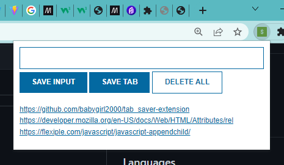

Quick start:

```
$ npm install
$ npm start
````

## About tabs tracker
This project is called tabs tracker. As the name implies it is a chrome extension written in HTML, CSS and JavaScript. It aims at saving links of active websites in the chrome browser or links entered by the user. It makes use of localstorage, in this way the user can revisite their saved links and either delete or use them how ever they want.


